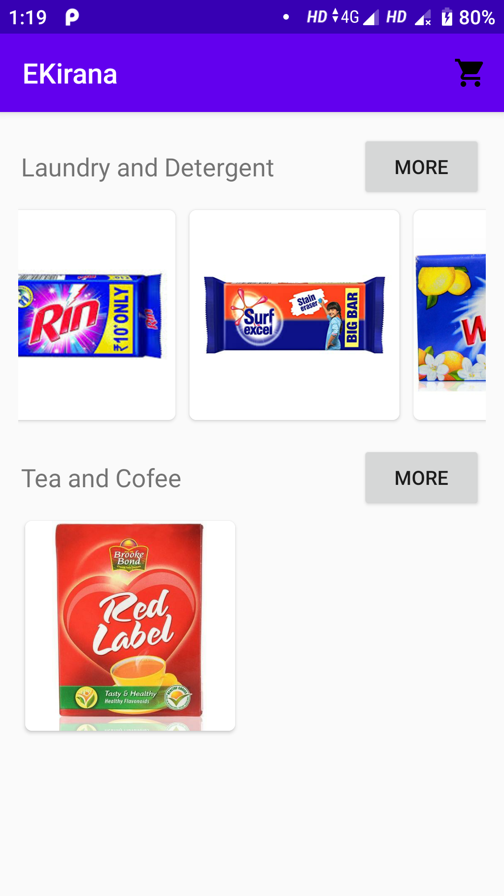
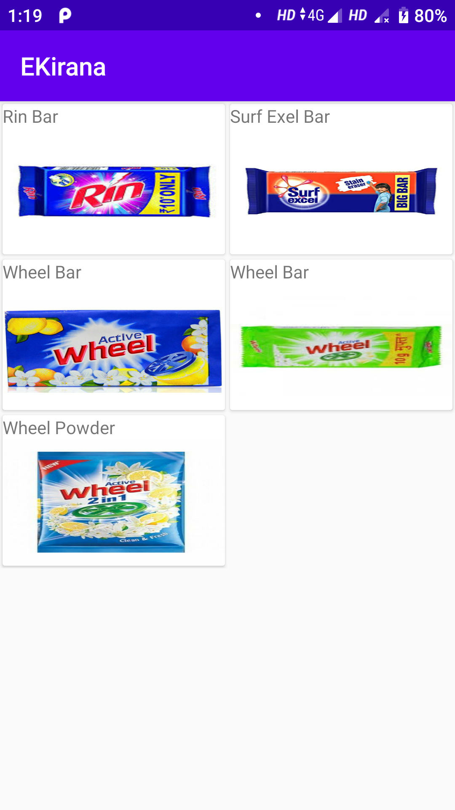
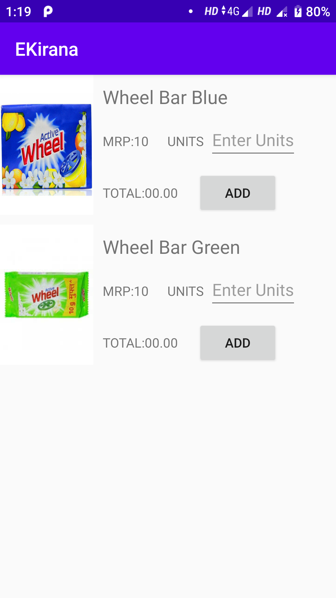
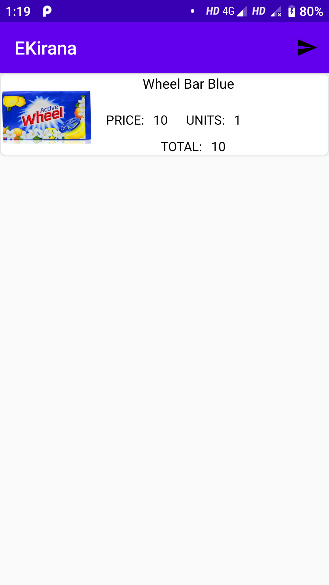

# E-Kirana
It is an Ecommerce Android app for Kirana Stores. Where User can create his monthly kirana list and then can be sent to shopkeeper.
It Aims to reduce rush in local stores and to increase efficiency of shopkeepers.

More Features will be added soon..

<b>Languages and library used:</b> 
Java, Retrofit, Volley, Mysql, Rest API, PHP

<h2> Home Page After Login </h2>

<h2>After Selecting Particular Category </h2>

<h2> Sub Category with units and price</h2>

<h2>Selected Item Added to list </h2>

